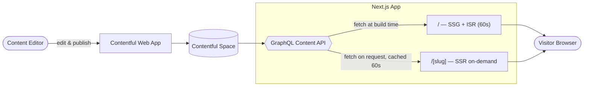
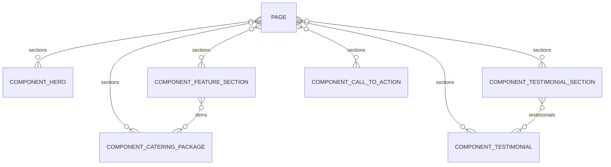

# Contentful Demo — Adequate Catering Co.

[](https://github.com/nilpointr/contentful-demo/actions/workflows/ci.yml)


A proof-of-concept demonstrating [Contentful](https://www.contentful.com) as a headless CMS
backing a Next.js site for Adequate Catering Co., a fictional catering business that promises
nothing more than adequacy. Scope is intentionally small: a homepage and one marketing landing
page, both content-managed.

## Tech Stack

| Layer           | Choice                                                                                           |
| --------------- | ------------------------------------------------------------------------------------------------ |
| Framework       | [Next.js](https://nextjs.org) (App Router)                                                       |
| Language        | TypeScript                                                                                       |
| Package manager | pnpm                                                                                             |
| CMS             | Contentful (Free/Community tier)                                                                 |
| Content API     | Contentful [GraphQL Content API](https://www.contentful.com/developers/docs/references/graphql/) |
| Hosting         | TBD                                                                                              |

## Prerequisites

- Node.js 22 or later
- [pnpm](https://pnpm.io) — install with `npm install -g pnpm` if you don't have it
- A [Contentful](https://www.contentful.com) account with an empty space created (Free/Community
  tier is enough)

## Project Structure

```
app/                    Next.js App Router routes
  page.tsx                 Homepage (page entry with slug "/")
  [slug]/page.tsx           Any other page, looked up by slug
components/              UI components — section renderers, header/footer, image placeholder
lib/contentful.ts        GraphQL client + typed queries against the Content Delivery/Preview API
migrations/               Content types defined as code (contentful-migration), one file per type
midjourney-prompts.md    Prompts for the placeholder images, mapped to Contentful entries/fields
```

## Architecture



The homepage (`/`) is statically prerendered at build time; any other page (`/[slug]`) is
server-rendered on request. Both paths go through the same GraphQL client, and both cache the
Contentful response for 60 seconds (Next.js's Data Cache) — so "on-demand" doesn't mean "hits
Contentful every request." See [Troubleshooting](#troubleshooting) for the caching gotcha this
causes.

## Contentful Resources

- [contentful.com](https://www.contentful.com) — product site
- [Developer docs](https://www.contentful.com/developers/docs/) — API reference, guides
- [GraphQL Content API reference](https://www.contentful.com/developers/docs/references/graphql/) — the API this project queries
- [github.com/contentful](https://github.com/contentful) — official SDKs, tools, examples
- [Web app login](https://be.contentful.com/login) — space/content management UI

## Content Model

Following Contentful's [domain model](https://www.contentful.com/developers/docs/concepts/domain-model/)
and [data model](https://www.contentful.com/developers/docs/concepts/data-model/) docs — composability
via reference fields over deep nesting — the homepage and landing page share a single page-builder
model instead of separate rigid content types.

| Content Type                  | Purpose                              | Key fields                                                                                      |
| ----------------------------- | ------------------------------------ | ----------------------------------------------------------------------------------------------- |
| `page`                        | Homepage & landing page (same shape) | `internalName`, `title`, `slug` (unique), `seoTitle`, `seoDescription`, `sections` (references) |
| `componentHero`               | Top banner                           | `heading`, `subheading`, `backgroundImage`, `ctaText`, `ctaLink`                                |
| `componentCateringPackage`    | A single package/offering            | `name`, `description`, `image`, `price`, `servingsInfo`                                         |
| `componentFeatureSection`     | Grid of packages                     | `heading`, `items` (references to `componentCateringPackage`)                                   |
| `componentTestimonial`        | Single quote                         | `quote`, `authorName`, `authorRole`, `avatar`                                                   |
| `componentTestimonialSection` | Group of testimonials                | `heading`, `testimonials` (references to `componentTestimonial`)                                |
| `componentCallToAction`       | Closing CTA banner                   | `heading`, `body`, `buttonText`, `buttonLink`                                                   |

The homepage is a `page` entry with slug `/`; the landing page is another `page` entry with its own
slug — both assembled from the same reusable section types via the `sections` field.



Relationships are many-to-many, not one-to-many — the same component entry can be (and is)
reused across multiple pages or sections. The seeded content actually does this: both pages
share the same testimonial section entry.

Each content type's `internalName` field is marked `omitted` (editor-only, hidden from the Delivery
API response) per the data model docs' guidance on separating editorial fields from public output.

Content types are defined as code in [`migrations/`](./migrations), one file per type, applied in
dependency order (components before the `page` type that references them) via
[contentful-migration](https://github.com/contentful/contentful-migration).

## Getting Started

```bash
pnpm install
```

### 1. Contentful space setup

```bash
# authenticate the CLI (opens browser)
pnpm run contentful:login

# point the CLI at your space
pnpm run contentful:use-space

# apply all content type migrations, in order
pnpm run contentful:migrate
```

### 2. Environment variables

```bash
cp .env.example .env.local
```

Fill in `.env.local` (gitignored, never commit real tokens) with values from the Contentful web
app for your space (adding an API key under **Settings > API keys** generates a Delivery token and
a Preview token together):

| Variable                    | Purpose                                                               |
| --------------------------- | --------------------------------------------------------------------- |
| `CONTENTFUL_SPACE_ID`       | Space identifier, found in **Settings > General settings**            |
| `CONTENTFUL_ENVIRONMENT`    | Space environment, `master` for this POC                              |
| `CONTENTFUL_DELIVERY_TOKEN` | Content Delivery API — published content only                         |
| `CONTENTFUL_PREVIEW_TOKEN`  | Content Preview API — includes unpublished drafts, for a preview mode |

None of these are prefixed `NEXT_PUBLIC_` — Contentful data is fetched server-side (App Router
Server Components), so tokens stay out of the client bundle.

### 3. Run the app

```bash
pnpm run dev      # dev server at http://localhost:3000
pnpm run build    # production build
pnpm run start    # run the production build
```

## Scripts

| Script                          | What it does                          |
| ------------------------------- | ------------------------------------- |
| `pnpm run dev`                  | Start the Next.js dev server          |
| `pnpm run build`                | Production build                      |
| `pnpm run start`                | Run the production build              |
| `pnpm run lint`                 | Lint the codebase                     |
| `pnpm run format`               | Format the codebase with Prettier     |
| `pnpm run format:check`         | Check formatting without writing (CI) |
| `pnpm run test`                 | Run the test suite (Vitest)           |
| `pnpm run contentful:login`     | Authenticate the Contentful CLI       |
| `pnpm run contentful:use-space` | Point the CLI at this project's space |
| `pnpm run contentful:migrate`   | Apply all content type migrations     |

## Editing Content

Two separate workflows, depending on what's changing:

- **Schema changes** (new content type, new field) — add a migration file under `migrations/` and
  run `pnpm run contentful:migrate`. Keeps the content model versioned as code.
- **Content changes** (new page, new copy, new catering package) — log into the
  [Contentful web app](https://be.contentful.com/login), edit or create entries directly, and
  publish. No code changes needed.

Because both pages are built from the same reusable section types, adding a third page is pure
content work: create a new `page` entry with its own `slug`, compose it from existing (or new)
section entries, and publish. The `[slug]` route picks it up automatically.

## Images

The site renders a dashed-border placeholder anywhere an image field is empty. See
[`midjourney-prompts.md`](./midjourney-prompts.md) for prompts to generate the real images —
upload the result as an Asset in Contentful and link it to the relevant field, no code changes
required.

## Troubleshooting

- **Published a content change but the app still shows the old version?** GraphQL responses are
  cached for 60 seconds (`revalidate: 60` in `lib/contentful.ts`), and that cache persists in
  `.next/cache` across dev server restarts. Wait out the window, or delete `.next/` to force a
  fresh fetch.

## License

No license — private demo project, not intended for reuse or distribution.

## Status

Homepage and landing page are live end-to-end (content model, seeded copy, GraphQL fetching,
styled rendering, images). Hosting/deployment not yet set up.
